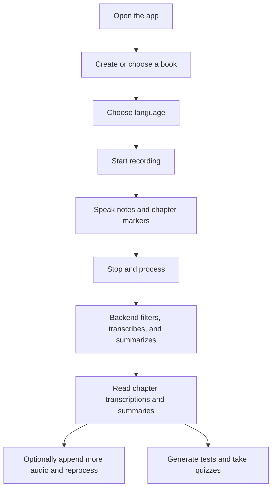
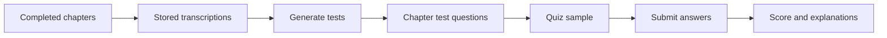
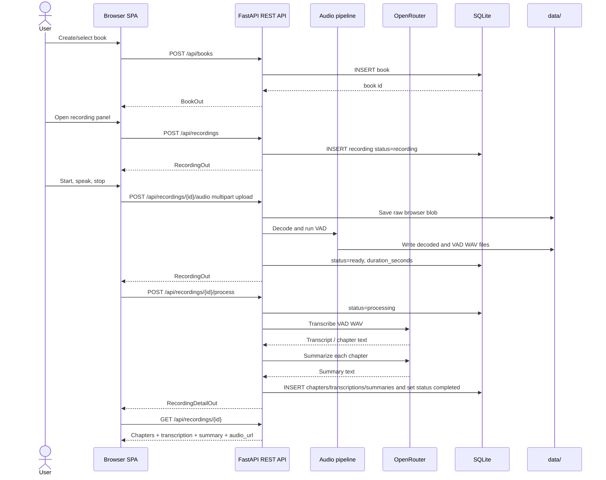
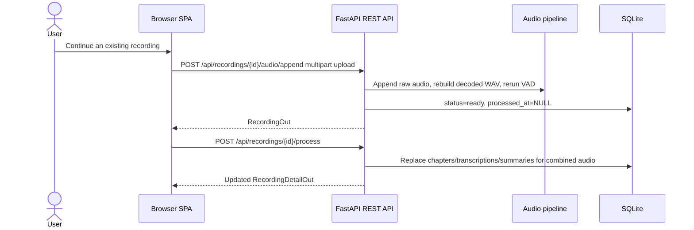
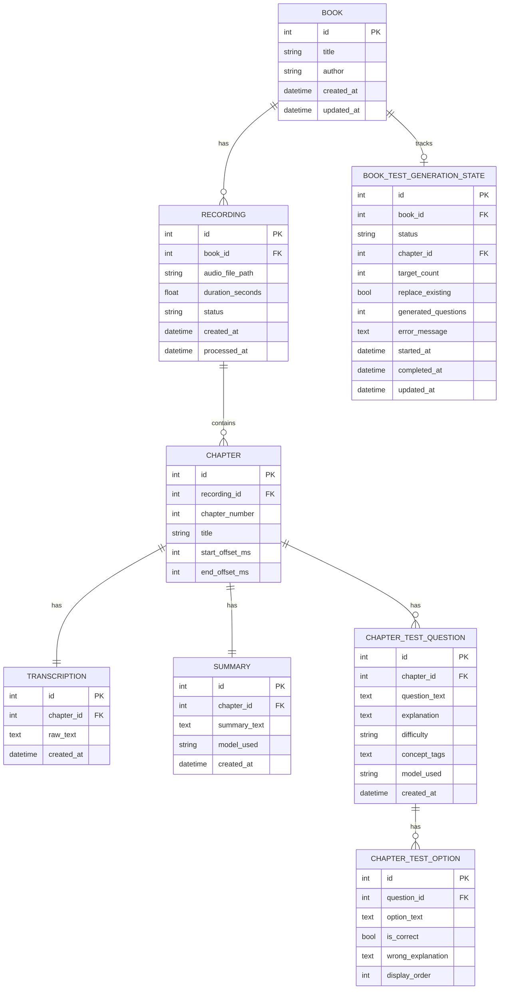

# Summarization Memory Helper

Summarization Memory Helper is a small local web app for turning spoken book notes into structured chapter summaries.

You create a book, record yourself retelling or discussing it, say a chapter marker when you move to a new chapter, and the app stores:

- the book and recording metadata;
- the raw browser audio;
- a decoded diagnostic WAV file;
- a VAD-filtered WAV file used for transcription;
- chapter-level transcriptions;
- chapter-level AI summaries;
- optional generated multiple-choice tests and quiz results for completed chapters.

The app is intentionally simple: one FastAPI backend serves both the API and the static vanilla-JS frontend. Docker is the recommended way to run it.

---

## Table of contents

- [For users](#for-users)
  - [What you need](#what-you-need)
  - [Quick start with Docker](#quick-start-with-docker)
  - [How to use the app](#how-to-use-the-app)
  - [Generated tests and quiz sessions](#generated-tests-and-quiz-sessions)
  - [Where your data is stored](#where-your-data-is-stored)
  - [Changing models and settings](#changing-models-and-settings)
  - [Running without Docker](#running-without-docker)
  - [Troubleshooting](#troubleshooting)
- [For developers: architecture](#for-developers-architecture)
  - [Tech stack](#tech-stack)
  - [Project structure](#project-structure)
  - [Runtime flow](#runtime-flow)
  - [Audio processing pipeline](#audio-processing-pipeline)
  - [Backend modules](#backend-modules)
  - [Frontend modules](#frontend-modules)
  - [Database model](#database-model)
  - [API surface](#api-surface)
  - [Configuration model](#configuration-model)
  - [Runtime files](#runtime-files)
  - [Developer tests](#developer-tests)

---

# For users

## What you need

### Required

1. [Docker Desktop](https://www.docker.com/products/docker-desktop/) or Docker Engine with the Compose plugin.
2. An [OpenRouter API key](https://openrouter.ai/keys).
3. A browser with microphone support, such as Chrome, Edge, Firefox, or Safari.

### Recommended

- A working microphone.
- A quiet environment. The app filters silence and noise, but clean speech gives better transcriptions.
- Short test recordings first, before recording a long book session.

---

## Quick start with Docker

### 1. Create your environment file

Copy the example file:

```bash
cp .env.example .env
```

On Windows Command Prompt, use:

```cmd
copy .env.example .env
```

### 2. Add your OpenRouter key

Open `.env` and set:

```dotenv
OPENROUTER_API_KEY=sk-or-your-real-key-here
```

Do not commit `.env`. It contains your private API key.

### 3. Build and start the app

```bash
docker compose up --build
```

The first build can take a few minutes because Docker installs Python packages and native audio dependencies.

### 4. Open the app

Go to:

```text
http://localhost:8000
```

The API documentation is also available at:

```text
http://localhost:8000/api/docs
```

### 5. Stop the app

Press `Ctrl+C` in the terminal, then run:

```bash
docker compose down
```

Your recordings and database stay in `data/` on your machine.

---

## How to use the app

1. Open `http://localhost:8000`.
2. Create a book by entering its title and, optionally, author.
3. Open the book.
4. Choose the transcription language.
   - The default is Russian (`ru`).
   - Use English (`en`) for English recordings.
   - Use auto-detection if your configured model supports it.
5. Click **Start Recording**.
6. Allow microphone access in the browser.
7. Speak naturally.
8. When you move to a new chapter, say a clear marker such as:
   - “new chapter”
   - “chapter two”
   - “next chapter”
   - “глава один”
9. Use **Pause** and **Resume** if needed. Paused time is not included in the final browser audio blob.
10. Click **Stop & Process**.
11. Wait while the app:
    - uploads the complete browser recording;
    - decodes it with FFmpeg;
    - removes non-speech parts with VAD;
    - sends the VAD-filtered WAV to OpenRouter for transcription;
    - detects chapter boundaries;
    - summarizes each chapter;
    - saves the result.
12. Review the chapter view with the audio player, transcription, and summary.
13. If you need to add more spoken notes to an existing recording, use the recording continuation flow in the book detail view. The app uploads a new browser audio blob, appends it to the existing recording, rebuilds decoded/VAD audio, and reprocesses the full combined recording.
14. After at least one recording is completed, open the test view to generate multiple-choice questions from stored chapter transcriptions and run quiz sessions.



---

## Generated tests and quiz sessions

Completed chapters with non-empty transcriptions can be converted into persistent multiple-choice tests.

Typical workflow:

1. Process at least one recording until its status is `completed`.
2. Open **Tests** for the book.
3. Choose a scope:
   - all completed chapters;
   - one specific completed chapter.
4. Set how many questions to generate per chapter. The API accepts `1` to `30`; the UI default is `10`.
5. Click **Generate tests**. Existing questions in the selected scope are replaced by default.
6. Choose a quiz sample size. The API accepts `1` to `100`; the UI default is up to `10`.
7. Click **Start quiz**, answer all sampled questions, and submit.
8. Review the score, the correct option, and the explanation for wrong answers.

Test generation uses the configured OpenRouter summarization model. Generated tests are stored in SQLite, so they remain available after restarting the container.



---

## Where your data is stored

Docker bind-mounts the local `data/` directory into the container at `/app/data`.

Main runtime files:

```text
data/
├── app.db                 # SQLite database
├── raw_audio/             # complete browser uploads, usually WebM or Ogg
├── decoded_audio/         # full decoded WAV files for diagnostics
├── vad_audio/             # VAD-filtered WAV files used for transcription and playback
├── audio/                 # legacy/live WAV directory
└── recordings/            # legacy/runtime directory
```

This means:

- stopping or rebuilding the Docker container does not delete your data;
- deleting `data/app.db` deletes the app database;
- deleting files in `data/vad_audio/` can break audio playback for existing recordings;
- deleting `data/raw_audio/` removes original browser uploads, but already processed summaries remain in the database.

The repository includes a `.gitignore` entry for `data/`, so local recordings and databases are not accidentally committed.

---

## Changing models and settings

Most defaults live in `config/settings.yaml`.

Important settings:

```yaml
audio:
  sample_rate: 16000
  frame_duration_ms: 30
  vad_aggressiveness: 2
  min_speech_duration_ms: 100
  max_silence_ms: 500
  raw_storage_dir: "./data/raw_audio"
  vad_storage_dir: "./data/vad_audio"
  decoded_storage_dir: "./data/decoded_audio"
  min_transcription_audio_bytes: 32044

openrouter:
  transcription:
    model: "google/gemini-3.1-flash-lite-preview"
    default_language: "ru"
  summarization:
    model: "google/gemini-3.1-pro-preview"
    max_tokens: 512000
    temperature: 0.1
    default_modes: "dense_summary, key_facts, triples, quotes, categories"
    language: "auto"
    density_iterations: 3
```

Use `.env` for secrets and local overrides. At minimum, set:

```dotenv
OPENROUTER_API_KEY=sk-or-your-real-key-here
```

You can also override nested settings with environment variables. For example:

```dotenv
OPENROUTER__SUMMARIZATION__MODEL=google/gemini-3.1-pro-preview
AUDIO__VAD_AGGRESSIVENESS=1
OPENROUTER__SUMMARIZATION__DEFAULT_MODES=dense_summary,key_facts
```

---

## Running without Docker

Docker is easier because it installs FFmpeg for you. If you run locally, install FFmpeg on the host first and make sure the `ffmpeg` command is available in your terminal.

### Windows PowerShell

```powershell
python -m venv .venv
.venv\Scripts\Activate.ps1
pip install -r requirements.txt
copy .env.example .env
# Edit .env and set OPENROUTER_API_KEY
uvicorn backend.main:app --reload --host 0.0.0.0 --port 8000
```

### Windows Command Prompt

```cmd
python -m venv .venv
.venv\Scripts\activate.bat
pip install -r requirements.txt
copy .env.example .env
rem Edit .env and set OPENROUTER_API_KEY
uvicorn backend.main:app --reload --host 0.0.0.0 --port 8000
```

### macOS / Linux

```bash
python -m venv .venv
source .venv/bin/activate
pip install -r requirements.txt
cp .env.example .env
# Edit .env and set OPENROUTER_API_KEY
uvicorn backend.main:app --reload --host 0.0.0.0 --port 8000
```

Then open:

```text
http://localhost:8000
```

---

## Troubleshooting

### The app does not start

Check that `.env` exists and contains a valid OpenRouter key:

```dotenv
OPENROUTER_API_KEY=sk-or-your-real-key-here
```

For Docker, rebuild after dependency or Dockerfile changes:

```bash
docker compose up --build
```

### Browser says microphone access is blocked

- Use `http://localhost:8000`, not a random local file path.
- Check the browser permission icon near the address bar.
- Make sure another app is not exclusively using the microphone.

### Processing fails with an FFmpeg error

- With Docker: rebuild the image.
- Without Docker: install FFmpeg and confirm this works:

```bash
ffmpeg -version
```

### “VAD did not detect speech” or “audio is too short”

The app intentionally does not transcribe empty or nearly empty VAD output.

Try again with:

- a longer recording;
- clearer speech;
- less background noise;
- the microphone closer to your mouth;
- a less aggressive VAD setting in `config/settings.yaml`.

### Summaries are low quality or in the wrong language

- Pick the correct language before recording.
- Check the transcription model in `config/settings.yaml`.
- Update the summarization system prompt in `config/settings.yaml`.
- Use a stronger OpenRouter model for summarization.

### Test generation fails

- Make sure the book has at least one `completed` recording.
- Make sure completed chapters have non-empty transcriptions.
- Check the OpenRouter API key and summarization model, because the test generator uses the summarization model.
- Try generating fewer questions per chapter.

### Port 8000 is already in use

Stop the other process or change the port mapping in `docker-compose.yml`.

---

# For developers: architecture

## Tech stack

| Layer | Technology |
| --- | --- |
| Backend | Python 3.11, FastAPI, Uvicorn |
| Persistence | SQLAlchemy ORM, SQLite |
| Audio | Browser MediaRecorder, FFmpeg, WebRTC VAD |
| AI | OpenRouter API for transcription and summarization |
| Frontend | Static HTML, CSS, vanilla JavaScript modules |
| Rendering | Marked, DOMPurify, Mermaid loaded from CDN in the browser |
| Configuration | `config/settings.yaml` plus `.env` / environment variables |
| Tests | Pytest with isolated SQLite databases and monkeypatched OpenRouter calls |
| Deployment | Dockerfile and Docker Compose |

---

## Project structure

```text
summarization-memory-helper/
├── backend/
│   ├── main.py                    # FastAPI app factory, mounts API and static frontend
│   ├── api/
│   │   ├── books.py               # Book CRUD endpoints
│   │   ├── recordings.py          # Recording lifecycle, upload, processing, deletion
│   │   ├── tests.py               # Generated test and quiz endpoints
│   │   └── websocket_audio.py     # WebSocket audio route kept in backend API layer
│   ├── core/
│   │   ├── config.py              # Settings loading and validation
│   │   ├── database.py            # SQLAlchemy engine/session/bootstrap
│   │   └── exceptions.py          # HTTP exception helpers
│   ├── models/
│   │   └── orm.py                 # SQLAlchemy tables and relationships
│   ├── schemas/
│   │   └── api.py                 # Pydantic request/response models
│   └── services/
│       ├── audio_pipeline.py      # Raw upload → decoded WAV → VAD WAV
│       ├── raw_audio_storage.py   # Saves uploaded browser audio blobs
│       ├── vad_service.py         # VAD processor wrapper
│       ├── openrouter_client.py   # OpenRouter transcription and summary calls
│       ├── chapter_parser.py      # Converts LLM/chapter output to structured chapters
│       ├── test_generator.py      # Persistent multiple-choice test generation/scoring
│       └── processor.py           # End-to-end transcription/summarization orchestrator
├── frontend/
│   ├── index.html                 # Static SPA shell
│   ├── css/styles.css             # Application styles
│   └── js/
│       ├── app.js                 # Client-side routing/state
│       ├── api.js                 # REST upload/client helpers
│       ├── recorder.js            # Browser MediaRecorder wrapper
│       ├── summaryRenderer.js     # Safe Markdown/Mermaid summary renderer
│       └── components/            # UI views
├── tests/                         # Pytest coverage for audio append and generated tests
├── config/settings.yaml           # Non-secret runtime defaults
├── data/                          # Local runtime data, ignored by Git
├── Dockerfile
├── docker-compose.yml
├── .dockerignore
├── .env.example
└── requirements.txt
```

---

## Runtime flow

The current primary recording flow is post-recording upload, not continuous chunk transcription.



Existing recordings can also be extended:



---

## Audio processing pipeline

The backend keeps multiple audio artifacts because each one answers a different question:

1. **Raw browser blob**: what the browser produced.
2. **Decoded WAV**: what FFmpeg decoded from that blob.
3. **VAD WAV**: what the app considers speech and sends to the AI model.


Important behavior:

- VAD output is required. The pipeline does not fall back to raw audio if no speech is detected.
- The browser-playable audio URL points to `/media/audio/{recording_id}.wav`, backed by `data/vad_audio/`.
- Appending audio rewrites the combined decoded/VAD artifacts for that recording and clears `processed_at` until reprocessing succeeds.
- Runtime audio directories are created at application startup.

---

## Backend modules

### Application setup

- `backend/main.py` creates the FastAPI app.
- It initializes data directories during lifespan startup.
- It creates SQLAlchemy tables with `create_all_tables()`.
- It includes API routers.
- It mounts:
  - `/media/audio` for VAD WAV playback;
  - `/` for the static frontend.

### API layer

- `backend/api/books.py` owns book CRUD.
- `backend/api/recordings.py` owns recording lifecycle:
  - create recording row;
  - upload raw audio;
  - finalize audio;
  - process transcription/summarization;
  - return detail with chapters;
  - append audio to an existing recording and rerun VAD;
  - delete recordings.
- `backend/api/tests.py` owns generated test and quiz endpoints under `/api/books/{book_id}/tests/...`.
- `backend/api/websocket_audio.py` remains part of the API layer for WebSocket audio handling, but the current UI path uses complete raw upload and offline VAD.

### Service layer

- `backend/services/raw_audio_storage.py` stores the uploaded browser blob.
- `backend/services/audio_pipeline.py` decodes audio and runs offline VAD.
- `backend/services/vad_service.py` wraps WebRTC VAD frame processing.
- `backend/services/openrouter_client.py` calls OpenRouter.
- `backend/services/chapter_parser.py` normalizes chapter output.
- `backend/services/test_generator.py` generates persistent multiple-choice tests, samples quiz questions, and scores submitted answers.
- `backend/services/processor.py` coordinates transcription, chapter creation, summaries, and status transitions.

---

## Frontend modules

The frontend has no build step and is served directly by FastAPI.

- `frontend/index.html`: static page shell.
- `frontend/js/app.js`: app-level state and client-side view switching.
- `frontend/js/api.js`: HTTP helpers for JSON requests and multipart audio upload.
- `frontend/js/recorder.js`: MediaRecorder wrapper that starts, pauses, resumes, stops, and returns the final Blob.
- `frontend/js/summaryRenderer.js`: safe Markdown renderer for summaries, including Mermaid diagrams.
- `frontend/js/components/bookList.js`: book list and create-book UI.
- `frontend/js/components/bookDetail.js`: selected-book details and recording list.
- `frontend/js/components/recordingPanel.js`: recording workflow UI.
- `frontend/js/components/chapterView.js`: audio playback, transcription, and summary display.
- `frontend/js/components/testView.js`: generated test controls, quiz sampling, answer submission, and score display.
- `frontend/css/styles.css`: visual styling.

---

## Database model



Recording status lifecycle:

```text
recording -> ready -> processing -> completed
                         └──────-> error
recording ───────────────────────> error
```

---

## API surface

### Meta

| Method | Path | Purpose |
| --- | --- | --- |
| `GET` | `/api/health` | Health check |
| `GET` | `/api/docs` | Swagger UI |
| `GET` | `/api/redoc` | ReDoc UI |
| `GET` | `/api/openapi.json` | OpenAPI schema |

### Books

| Method | Path | Purpose |
| --- | --- | --- |
| `GET` | `/api/books` | List books |
| `POST` | `/api/books` | Create book |
| `GET` | `/api/books/{book_id}` | Get book with recordings |
| `PATCH` | `/api/books/{book_id}` | Update title and/or author |
| `DELETE` | `/api/books/{book_id}` | Delete book and cascading data |

### Recordings

| Method | Path | Purpose |
| --- | --- | --- |
| `POST` | `/api/recordings` | Create recording row for a book |
| `POST` | `/api/recordings/{recording_id}/audio` | Upload complete raw browser audio and run offline VAD |
| `POST` | `/api/recordings/{recording_id}/audio/append` | Append browser audio to an existing recording and rerun offline VAD |
| `POST` | `/api/recordings/{recording_id}/process` | Transcribe VAD audio, detect chapters, summarize chapters |
| `GET` | `/api/recordings/{recording_id}` | Get recording detail with chapters and audio URL |
| `DELETE` | `/api/recordings/{recording_id}` | Delete recording and associated audio file |

### Generated tests and quizzes

| Method | Path | Purpose |
| --- | --- | --- |
| `GET` | `/api/books/{book_id}/tests/availability` | List completed chapters, question counts, and generation state |
| `POST` | `/api/books/{book_id}/tests/generate` | Generate multiple-choice tests from one chapter or all completed chapters |
| `POST` | `/api/books/{book_id}/tests/sample` | Sample generated questions for a quiz session |
| `POST` | `/api/books/{book_id}/tests/submit` | Score submitted quiz answers and return explanations |

### Static runtime media

| Method | Path | Purpose |
| --- | --- | --- |
| `GET` | `/media/audio/{recording_id}.wav` | Play the VAD-filtered WAV file in the browser |

---

## Configuration model

Configuration is loaded from two places:

1. `config/settings.yaml` for safe, non-secret defaults.
2. `.env` / environment variables for secrets and local overrides.

Key groups:

- `audio`: sample rate, frame size, VAD behavior, runtime directories, minimum transcription audio size.
- `openrouter`: API key plus transcription, summarization, summary modes, and test-generation model settings.
- `database`: SQLAlchemy database URL.
- `app` / root settings: app name and debug behavior.

Secrets should stay in `.env`, never in `config/settings.yaml`.

---

## Runtime files

The application writes runtime state under `data/`:

| Path | Produced by | Purpose |
| --- | --- | --- |
| `data/app.db` | SQLAlchemy | SQLite database |
| `data/raw_audio/` | raw upload service | Original browser recordings |
| `data/decoded_audio/` | audio pipeline | Full decoded WAV diagnostics |
| `data/vad_audio/` | audio pipeline | Speech-only WAVs used for transcription and playback |
| `data/vad_audio/{recording_id}_chunks/` | processor | Temporary/derived VAD chunks for long-recording transcription |
| `data/audio/` | legacy audio path | Kept for compatibility with earlier pipeline code |
| `data/recordings/` | legacy/runtime path | Kept for compatibility |

These files are intentionally ignored by Git.

---

## Developer tests

Run the test suite with:

```bash
pytest
```

Current tests focus on local deterministic behavior and avoid real OpenRouter calls by monkeypatching AI clients where needed:

- `tests/test_audio_append_pipeline.py`: verifies append/finalize behavior for raw, decoded, and VAD audio artifacts.
- `tests/test_chapter_tests.py`: verifies generated question persistence, replacement, sampling, scoring, and wrong-answer explanations.

When adding tests that touch the database, prefer temporary SQLite databases created under `tmp_path` and call `Base.metadata.create_all()` in the test fixture.

---

## License

See [LICENSE](LICENSE).
