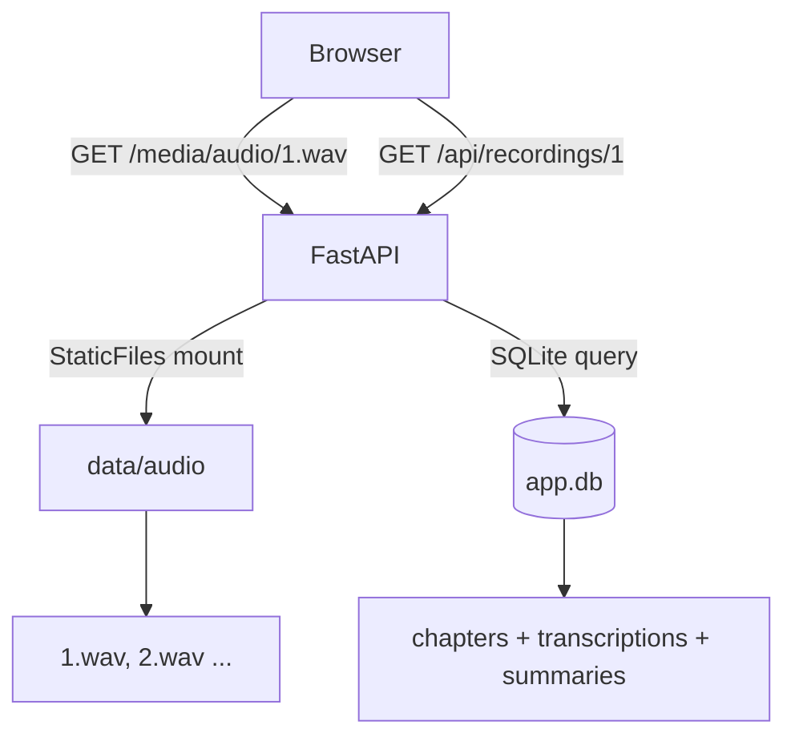
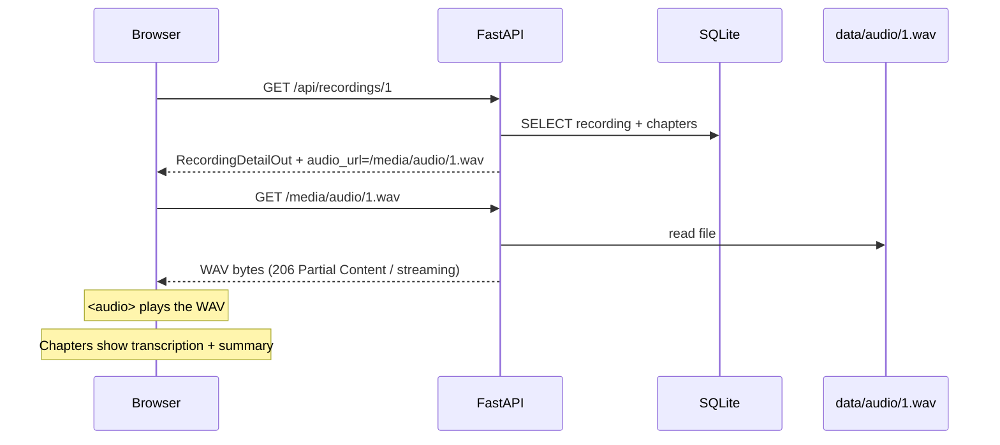

# Audio Chunks on Frontend — Plan

## Goal

Display audio recording files (WAV) on the frontend alongside their chapter-level **transcription** and **summarization**. Docker must serve the audio files from the `data/audio/` directory so the browser can play them.

---

## Architecture Overview



### Current data flow (unchanged)
```
Browser mic → WebSocket /ws/audio/{id}
  → ffmpeg (WebM→PCM)
  → VAD → speech segments
  → AudioWriter → data/audio/{id}.wav
```

### New: HTTP audio serving
```
Browser <audio src="/media/audio/{id}.wav">
  ← FastAPI StaticFiles /media/audio → ./data/audio/
```

---

## Files to Change

### 1. `Dockerfile`

Add `data/audio` to the directories created at build time (the volume will override at runtime, but the directory must exist for the image to be valid when the volume is NOT mounted).

```dockerfile
RUN mkdir -p data/recordings data/audio
```

### 2. `docker-compose.yml`

The existing `./data:/app/data` volume already covers `data/audio/`. No additional mount is needed. However, add a comment to make the audio serving explicit:

```yaml
volumes:
  - ./data:/app/data   # includes data/audio/ served at /media/audio/
```

### 3. `backend/main.py`

Mount `data/audio/` as HTTP static files **before** the catch-all frontend mount, but **after** the API routers, so it doesn't shadow any API route:

```python
from fastapi.staticfiles import StaticFiles

# After routers, before frontend:
audio_dir = Path(settings.audio.storage_dir)   # ./data/audio
audio_dir.mkdir(parents=True, exist_ok=True)
app.mount(
    "/media/audio",
    StaticFiles(directory=str(audio_dir)),
    name="audio_files",
)
```

This exposes `GET /media/audio/{recording_id}.wav` — the browser can `<audio src="/media/audio/1.wav">` directly.

### 4. `backend/schemas/api.py`

Add an optional `audio_url` computed field to `RecordingDetailOut` so the frontend receives the playback URL without having to construct it:

```python
class RecordingDetailOut(RecordingOut):
    chapters: List[FullChapterOut] = []
    audio_url: Optional[str] = None   # set by the endpoint
```

Update `GET /api/recordings/{id}` in `recordings.py` to populate `audio_url`:

```python
# In get_recording():
detail = RecordingDetailOut.model_validate(recording)
detail.audio_url = f"/media/audio/{recording.id}.wav"
return detail
```

> **Note:** The field is `Optional` because a recording in `recording` status may not yet have a finalized WAV file.

### 5. `frontend/js/components/chapterView.js`

Add an `<audio>` player at the top of the chapter view. The player shows the full recording WAV. Chapters below each display their own transcription and summary as today, but now visually grouped as "chunks":

#### `buildChapterViewHTML()` change

```html
<!-- NEW: audio player block -->
${recording.audio_url ? `
  <div class="audio-player-card card">
    <h3>🔊 Recording Audio</h3>
    <audio controls preload="metadata" class="audio-player"
           src="${escHtml(recording.audio_url)}">
      Your browser does not support the audio element.
    </audio>
  </div>
` : ""}

<!-- existing chapters list -->
${chaptersHTML}
```

#### `buildChapterItemHTML()` change

Each chapter represents a "chunk" with transcription + summary. Add a visual label to make clear it is a chunk:

```html
<div class="chapter-item">
  <div class="chapter-summary-row">
    <span class="chapter-label">Chunk ${chapter.chapter_number}</span>
    ${titleText}
  </div>
  <div class="chapter-body">
    <!-- transcription -->
    <!-- summary -->
  </div>
</div>
```

### 6. `frontend/css/styles.css`

Add styles for the audio player card and chunk label:

```css
/* Audio player */
.audio-player-card {
  margin-bottom: 1.5rem;
}

.audio-player {
  width: 100%;
  margin-top: 0.75rem;
  border-radius: 8px;
}

/* Chunk label badge */
.chapter-label {
  font-size: 0.75rem;
  font-weight: 600;
  text-transform: uppercase;
  letter-spacing: 0.05em;
  color: var(--color-primary);
  background: var(--color-primary-light, #eef2ff);
  padding: 2px 8px;
  border-radius: 4px;
  margin-right: 0.5rem;
}
```

---

## Docker Volume Mapping (Summary)

| Host path | Container path | Served at |
|---|---|---|
| `./data/audio/` | `/app/data/audio/` | `GET /media/audio/` |
| `./data/app.db` | `/app/data/app.db` | (internal SQLite) |

The existing `docker-compose.yml` volume `./data:/app/data` already maps all of `data/` into the container. FastAPI's `StaticFiles` mount at `/media/audio` reads from `/app/data/audio/` inside the container — no extra Docker config required.

---

## Sequence: View a Recording with Audio



---

## Implementation Order

1. `Dockerfile` — add `data/audio` mkdir  
2. `backend/main.py` — add StaticFiles mount for `/media/audio`  
3. `backend/schemas/api.py` — add `audio_url` to `RecordingDetailOut`  
4. `backend/api/recordings.py` — populate `audio_url` in `get_recording()`  
5. `frontend/js/components/chapterView.js` — add `<audio>` player and chunk labels  
6. `frontend/css/styles.css` — add audio player + chunk badge styles  

---

## Out of Scope (Future)

- Per-chapter audio slicing (requires audio offset alignment — `start_offset_ms` / `end_offset_ms` currently defaulted to 0)
- Waveform visualisation
- Audio download button (browser native controls already provide this)
