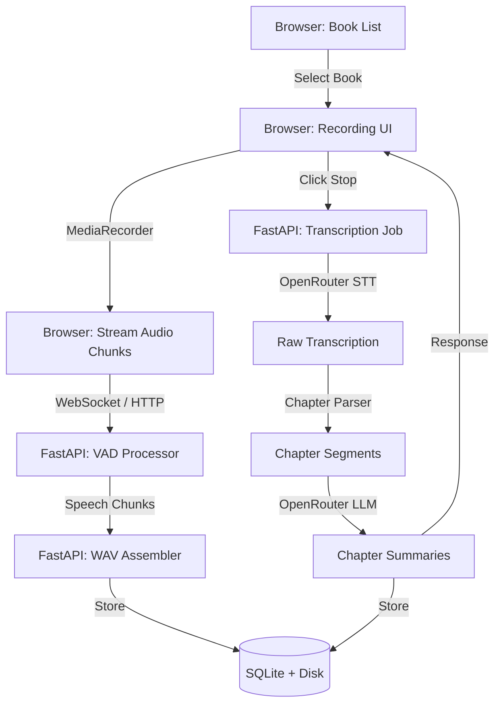
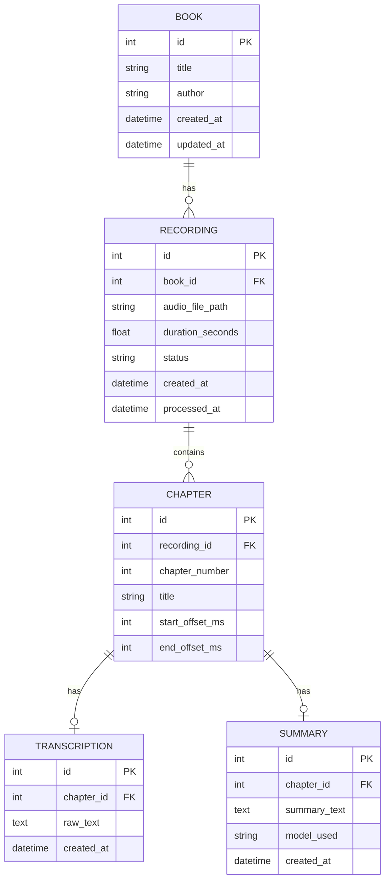
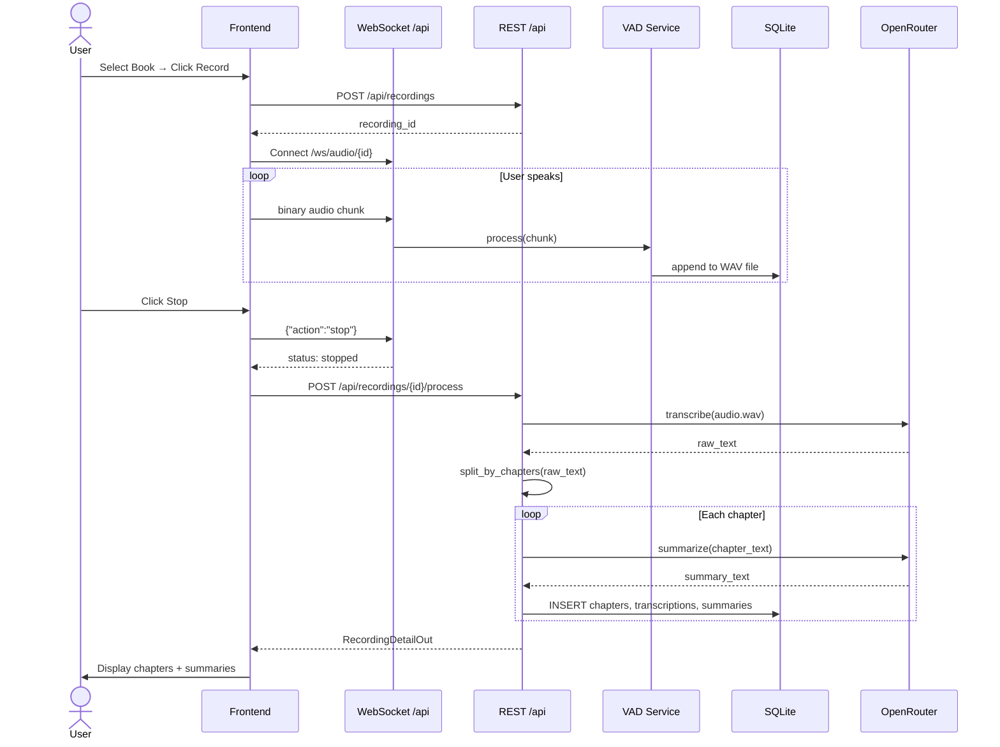

# Book Summarization Web App — System Architecture Design

## 1. Overview

A single-user web application for recording verbal book summaries, transcribing them via OpenRouter, detecting chapter boundaries from spoken markers, and persisting structured results in SQLite.

### High-Level Flow



---

## 2. Project Directory Structure

```
summarization-memory-helper/
├── config/
│   └── settings.yaml              # Runtime configuration
├── frontend/
│   ├── index.html                 # Main SPA shell
│   ├── css/
│   │   └── styles.css
│   └── js/
│       ├── app.js                 # Router / state
│       ├── api.js                 # HTTP/WebSocket client
│       ├── recorder.js            # MediaRecorder wrapper
│       └── components/
│           ├── bookList.js
│           ├── recordingPanel.js
│           └── chapterView.js
├── backend/
│   ├── main.py                    # FastAPI app factory
│   ├── api/
│   │   ├── __init__.py
│   │   ├── books.py               # Book CRUD endpoints
│   │   ├── recordings.py          # Recording lifecycle
│   │   └── websocket_audio.py     # VAD audio stream handler
│   ├── core/
│   │   ├── __init__.py
│   │   ├── config.py              # Pydantic Settings
│   │   ├── database.py            # SQLAlchemy engine/session
│   │   └── exceptions.py
│   ├── models/
│   │   ├── __init__.py
│   │   └── orm.py                 # SQLAlchemy table definitions
│   ├── schemas/
│   │   ├── __init__.py
│   │   └── api.py                 # Pydantic request/response models
│   ├── services/
│   │   ├── __init__.py
│   │   ├── vad_service.py         # webrtcvad wrapper
│   │   ├── audio_storage.py       # WAV save/load
│   │   ├── transcription.py       # OpenRouter STT client
│   │   ├── summarization.py       # OpenRouter LLM client
│   │   └── chapter_parser.py      # Marker detection logic
│   └── tests/
│       └── ...
├── data/
│   ├── app.db                     # SQLite database
│   └── audio/                     # Stored WAV files
├── requirements.txt
└── README.md
```

---

## 3. Database Schema (SQLite)

### 3.1 Tables

| Table | Purpose |
|-------|---------|
| `books` | Books the user is summarizing |
| `recordings` | A single recording session for a book |
| `chapters` | Detected chapters within a recording |
| `transcriptions` | Raw transcription text per chapter |
| `summaries` | LLM-generated summary per chapter |

### 3.2 SQLAlchemy ORM Definitions

**File:** [`backend/models/orm.py`](backend/models/orm.py)

```python
from datetime import datetime
from sqlalchemy import (
    Column, Integer, String, Text, DateTime,
    ForeignKey, Float, create_engine
)
from sqlalchemy.orm import declarative_base, relationship

Base = declarative_base()


class Book(Base):
    __tablename__ = "books"

    id = Column(Integer, primary_key=True, index=True)
    title = Column(String, nullable=False)
    author = Column(String, nullable=True)
    created_at = Column(DateTime, default=datetime.utcnow)
    updated_at = Column(DateTime, default=datetime.utcnow, onupdate=datetime.utcnow)

    recordings = relationship("Recording", back_populates="book", cascade="all, delete-orphan")


class Recording(Base):
    __tablename__ = "recordings"

    id = Column(Integer, primary_key=True, index=True)
    book_id = Column(Integer, ForeignKey("books.id"), nullable=False)
    audio_file_path = Column(String, nullable=False)   # path to WAV on disk
    duration_seconds = Column(Float, nullable=True)
    status = Column(String, default="recording")        # recording | processing | completed | error
    created_at = Column(DateTime, default=datetime.utcnow)
    processed_at = Column(DateTime, nullable=True)

    book = relationship("Book", back_populates="recordings")
    chapters = relationship("Chapter", back_populates="recording", cascade="all, delete-orphan")


class Chapter(Base):
    __tablename__ = "chapters"

    id = Column(Integer, primary_key=True, index=True)
    recording_id = Column(Integer, ForeignKey("recordings.id"), nullable=False)
    chapter_number = Column(Integer, nullable=False)
    title = Column(String, nullable=True)               # optional user-provided title
    start_offset_ms = Column(Integer, nullable=False)   # start in audio
    end_offset_ms = Column(Integer, nullable=False)     # end in audio

    recording = relationship("Recording", back_populates="chapters")
    transcription = relationship("Transcription", back_populates="chapter", uselist=False)
    summary = relationship("Summary", back_populates="chapter", uselist=False)


class Transcription(Base):
    __tablename__ = "transcriptions"

    id = Column(Integer, primary_key=True, index=True)
    chapter_id = Column(Integer, ForeignKey("chapters.id"), nullable=False)
    raw_text = Column(Text, nullable=False)
    created_at = Column(DateTime, default=datetime.utcnow)

    chapter = relationship("Chapter", back_populates="transcription")


class Summary(Base):
    __tablename__ = "summaries"

    id = Column(Integer, primary_key=True, index=True)
    chapter_id = Column(Integer, ForeignKey("chapters.id"), nullable=False)
    summary_text = Column(Text, nullable=False)
    model_used = Column(String, nullable=False)
    created_at = Column(DateTime, default=datetime.utcnow)

    chapter = relationship("Chapter", back_populates="summary")
```

### 3.3 ER Diagram



---

## 4. Configuration Schema

**File:** [`config/settings.yaml`](config/settings.yaml)

```yaml
app:
  name: "Book Summarizer"
  debug: false

audio:
  sample_rate: 16000          # webrtcvad requires 8/16/32 kHz; 16k is standard
  frame_duration_ms: 30       # 10, 20, or 30 ms frames for webrtcvad
  vad_aggressiveness: 2       # 0-3, higher = more aggressive filtering
  min_speech_duration_ms: 250 # drop speech shorter than this
  max_silence_ms: 1000        # allow 1s silence before splitting chunk
  storage_dir: "./data/audio"

openrouter:
  api_key: "${OPENROUTER_API_KEY}"   # read from env var
  transcription:
    model: "openai/whisper-1"        # or any OpenRouter-compatible STT model
    language: "en"
  summarization:
    model: "anthropic/claude-3.5-sonnet"
    max_tokens: 1024
    temperature: 0.3
    system_prompt: |
      You are a precise summarization assistant.
      Summarize the following book chapter transcript in 3-5 bullet points.
      Capture key arguments, events, and conclusions.

database:
  url: "sqlite:///./data/app.db"
```

**File:** [`backend/core/config.py`](backend/core/config.py)

```python
from pathlib import Path
from pydantic import Field
from pydantic_settings import BaseSettings, SettingsConfigDict


class AudioSettings(BaseSettings):
    sample_rate: int = 16000
    frame_duration_ms: int = 30
    vad_aggressiveness: int = 2
    min_speech_duration_ms: int = 250
    max_silence_ms: int = 1000
    storage_dir: Path = Path("./data/audio")


class OpenRouterTranscription(BaseSettings):
    model: str = "openai/whisper-1"
    language: str = "en"


class OpenRouterSummarization(BaseSettings):
    model: str = "anthropic/claude-3.5-sonnet"
    max_tokens: int = 1024
    temperature: float = 0.3
    system_prompt: str = "..."


class OpenRouterSettings(BaseSettings):
    api_key: str = Field(..., validation_alias="OPENROUTER_API_KEY")
    transcription: OpenRouterTranscription = OpenRouterTranscription()
    summarization: OpenRouterSummarization = OpenRouterSummarization()


class DatabaseSettings(BaseSettings):
    url: str = "sqlite:///./data/app.db"


class Settings(BaseSettings):
    model_config = SettingsConfigDict(
        env_file=".env",
        yaml_file="config/settings.yaml",
        yaml_file_encoding="utf-8",
        env_nested_delimiter="__",
        extra="ignore",
    )

    app_name: str = "Book Summarizer"
    debug: bool = False
    audio: AudioSettings = AudioSettings()
    openrouter: OpenRouterSettings = OpenRouterSettings()
    database: DatabaseSettings = DatabaseSettings()


settings = Settings()
```

---

## 5. Backend API Design (FastAPI)

### 5.1 Pydantic Schemas

**File:** [`backend/schemas/api.py`](backend/schemas/api.py)

```python
from datetime import datetime
from typing import List, Optional
from pydantic import BaseModel


# ---------- Books ----------

class BookCreate(BaseModel):
    title: str
    author: Optional[str] = None


class BookOut(BaseModel):
    id: int
    title: str
    author: Optional[str]
    created_at: datetime
    updated_at: datetime

    class Config:
        from_attributes = True


# ---------- Recordings ----------

class RecordingCreate(BaseModel):
    book_id: int


class RecordingOut(BaseModel):
    id: int
    book_id: int
    status: str
    duration_seconds: Optional[float]
    created_at: datetime
    processed_at: Optional[datetime]

    class Config:
        from_attributes = True


class RecordingProcessRequest(BaseModel):
    recording_id: int


# ---------- Chapters ----------

class ChapterOut(BaseModel):
    id: int
    recording_id: int
    chapter_number: int
    title: Optional[str]
    start_offset_ms: int
    end_offset_ms: int

    class Config:
        from_attributes = True


# ---------- Transcriptions & Summaries ----------

class TranscriptionOut(BaseModel):
    id: int
    chapter_id: int
    raw_text: str
    created_at: datetime

    class Config:
        from_attributes = True


class SummaryOut(BaseModel):
    id: int
    chapter_id: int
    summary_text: str
    model_used: str
    created_at: datetime

    class Config:
        from_attributes = True


class FullChapterOut(ChapterOut):
    transcription: Optional[TranscriptionOut]
    summary: Optional[SummaryOut]


class RecordingDetailOut(RecordingOut):
    chapters: List[FullChapterOut]
```

### 5.2 REST Endpoints

| Method | Path | Description | Request | Response |
|--------|------|-------------|---------|----------|
| `GET` | `/api/books` | List all books | — | `List[BookOut]` |
| `POST` | `/api/books` | Create a book | `BookCreate` | `BookOut` |
| `GET` | `/api/books/{id}` | Get book with recordings | — | `BookOut` + recordings |
| `DELETE` | `/api/books/{id}` | Delete book + cascade | — | `204` |
| `POST` | `/api/recordings` | Start a new recording | `RecordingCreate` | `RecordingOut` |
| `POST` | `/api/recordings/{id}/process` | Trigger transcription + summary | — | `RecordingDetailOut` |
| `GET` | `/api/recordings/{id}` | Get recording with chapters | — | `RecordingDetailOut` |
| `DELETE` | `/api/recordings/{id}` | Delete recording + audio | — | `204` |

### 5.3 WebSocket Endpoint

| Path | Protocol | Purpose |
|------|----------|---------|
| `/ws/audio/{recording_id}` | WebSocket | Stream audio chunks from browser; backend runs VAD and appends to WAV file |

**Message Flow:**

1. Client opens WebSocket with `recording_id`.
2. Client sends binary audio frames (e.g., 30ms Opus/PCM chunks).
3. Server runs `webrtcvad` on each frame.
4. When speech is detected, server appends to an in-memory buffer.
5. After silence > `max_silence_ms`, server writes buffered chunk to WAV file and appends to recording.
6. Client sends JSON `{"action": "stop"}` when user clicks stop.
7. Server finalizes WAV, updates `Recording.status = "ready"`, closes socket.

**File:** [`backend/api/websocket_audio.py`](backend/api/websocket_audio.py)

```python
from fastapi import APIRouter, WebSocket, WebSocketDisconnect
from backend.services.vad_service import VADProcessor
from backend.services.audio_storage import AudioWriter

router = APIRouter()


@router.websocket("/ws/audio/{recording_id}")
async def audio_stream(websocket: WebSocket, recording_id: int):
    await websocket.accept()
    vad = VADProcessor(recording_id=recording_id)
    writer = AudioWriter(recording_id=recording_id)

    try:
        while True:
            message = await websocket.receive()

            if "text" in message:
                data = json.loads(message["text"])
                if data.get("action") == "stop":
                    await writer.finalize()
                    await websocket.send_json({"status": "stopped", "recording_id": recording_id})
                    break

            elif "bytes" in message:
                pcm_bytes = decode_if_needed(message["bytes"])  # convert Opus/WebM -> PCM s16le if required
                speech_segments = vad.process(pcm_bytes)
                for seg in speech_segments:
                    await writer.append(seg)
                    await websocket.send_json({"status": "chunk_accepted", "ms": seg.duration_ms})

    except WebSocketDisconnect:
        await writer.finalize()
    finally:
        await writer.close()
```

---

## 6. Audio Pipeline Design

### 6.1 Browser Side

**File:** [`frontend/js/recorder.js`](frontend/js/recorder.js)

```javascript
class AudioRecorder {
  constructor(onChunk) {
    this.stream = null;
    this.mediaRecorder = null;
    this.ws = null;
  }

  async start(recordingId) {
    this.stream = await navigator.mediaDevices.getUserMedia({ audio: true });
    this.mediaRecorder = new MediaRecorder(this.stream, { mimeType: "audio/webm;codecs=opus" });
    this.ws = new WebSocket(`/ws/audio/${recordingId}`);

    this.mediaRecorder.ondataavailable = async (event) => {
      if (event.data.size > 0 && this.ws.readyState === WebSocket.OPEN) {
        // Send raw WebM/Opus chunk; backend will decode to PCM
        this.ws.send(await event.data.arrayBuffer());
      }
    };

    this.mediaRecorder.start(100); // emit chunk every 100ms
  }

  stop() {
    this.mediaRecorder.stop();
    this.stream.getTracks().forEach(t => t.stop());
    if (this.ws.readyState === WebSocket.OPEN) {
      this.ws.send(JSON.stringify({ action: "stop" }));
    }
  }
}
```

### 6.2 Backend VAD Service

**File:** [`backend/services/vad_service.py`](backend/services/vad_service.py)

```python
import webrtcvad
import collections
import wave
from dataclasses import dataclass
from typing import List, Optional
from backend.core.config import settings


@dataclass
class SpeechSegment:
    pcm_bytes: bytes
    duration_ms: int


class VADProcessor:
    """
    Processes a stream of PCM16 audio bytes using webrtcvad.
    Yields SpeechSegment objects when a complete utterance is detected.
    """

    def __init__(self, recording_id: int):
        self.vad = webrtcvad.Vad(settings.audio.vad_aggressiveness)
        self.sample_rate = settings.audio.sample_rate
        self.frame_duration_ms = settings.audio.frame_duration_ms
        self.frame_bytes = int(self.sample_rate * self.frame_duration_ms / 1000) * 2  # 16-bit

        self.ring_buffer: collections.deque = collections.deque(maxlen=int(settings.audio.max_silence_ms / self.frame_duration_ms))
        self.triggered = False
        self.buffered_frames: List[bytes] = []
        self.recording_id = recording_id

    def process(self, pcm_bytes: bytes) -> List[SpeechSegment]:
        """Accept raw PCM s16le bytes; return list of completed speech segments."""
        segments: List[SpeechSegment] = []
        offset = 0
        while offset + self.frame_bytes <= len(pcm_bytes):
            frame = pcm_bytes[offset:offset + self.frame_bytes]
            offset += self.frame_bytes
            is_speech = self.vad.is_speech(frame, self.sample_rate)

            if not self.triggered:
                self.ring_buffer.append((frame, is_speech))
                num_voiced = sum(1 for _, speech in self.ring_buffer if speech)
                if num_voiced > 0.9 * self.ring_buffer.maxlen:
                    self.triggered = True
                    self.buffered_frames = [f for f, _ in self.ring_buffer]
                    self.ring_buffer.clear()
            else:
                self.buffered_frames.append(frame)
                self.ring_buffer.append((frame, is_speech))
                num_unvoiced = sum(1 for _, speech in self.ring_buffer if not speech)
                if num_unvoiced > 0.9 * self.ring_buffer.maxlen:
                    self.triggered = False
                    segment_bytes = b"".join(self.buffered_frames)
                    duration_ms = len(segment_bytes) // 2 * 1000 // self.sample_rate
                    if duration_ms >= settings.audio.min_speech_duration_ms:
                        segments.append(SpeechSegment(pcm_bytes=segment_bytes, duration_ms=duration_ms))
                    self.buffered_frames = []
                    self.ring_buffer.clear()

        return segments

    def flush(self) -> Optional[SpeechSegment]:
        """Call when stream ends to capture trailing speech."""
        if self.triggered and self.buffered_frames:
            segment_bytes = b"".join(self.buffered_frames)
            duration_ms = len(segment_bytes) // 2 * 1000 // self.sample_rate
            if duration_ms >= settings.audio.min_speech_duration_ms:
                return SpeechSegment(pcm_bytes=segment_bytes, duration_ms=duration_ms)
        return None
```

### 6.3 Audio Storage Service

**File:** [`backend/services/audio_storage.py`](backend/services/audio_storage.py)

```python
import wave
import os
from pathlib import Path
from backend.core.config import settings


class AudioWriter:
    def __init__(self, recording_id: int):
        self.recording_id = recording_id
        self.dir = Path(settings.audio.storage_dir)
        self.dir.mkdir(parents=True, exist_ok=True)
        self.path = self.dir / f"{recording_id}.wav"
        self._wav: wave.Wave_write | None = None
        self._open()

    def _open(self):
        self._wav = wave.open(str(self.path), "wb")
        self._wav.setnchannels(1)
        self._wav.setsampwidth(2)  # 16-bit
        self._wav.setframerate(settings.audio.sample_rate)

    async def append(self, segment: "SpeechSegment"):
        self._wav.writeframes(segment.pcm_bytes)

    async def finalize(self):
        if self._wav:
            self._wav.close()
            self._wav = None

    async def close(self):
        await self.finalize()
```

### 6.4 Audio Decoding Note

Browsers emit `audio/webm;codecs=opus` from MediaRecorder. The backend must decode this to raw PCM s16le before feeding to `webrtcvad`.

**Approach:** Use [`ffmpeg-python`](https://github.com/kkroening/ffmpeg-python) or call `ffmpeg` directly in a subprocess to decode WebM chunks to PCM on the fly.

```python
# Pseudocode inside websocket handler
import subprocess

ffmpeg = subprocess.Popen(
    [
        "ffmpeg", "-i", "pipe:0", "-f", "s16le", "-acodec", "pcm_s16le",
        "-ar", str(settings.audio.sample_rate), "-ac", "1", "pipe:1"
    ],
    stdin=subprocess.PIPE,
    stdout=subprocess.PIPE,
    stderr=subprocess.DEVNULL,
)

# In loop:
ffmpeg.stdin.write(webm_chunk)
pcm_bytes = ffmpeg.stdout.read(expected_pcm_bytes)
```

Alternatively, buffer WebM chunks to a temp file and decode in batches if real-time streaming proves fragile.

---

## 7. Chapter Detection Logic Design

### 7.1 Problem

The user speaks phrases like:
- "new chapter"
- "next chapter"
- "chapter three"
- "chapter 4"

These markers must be detected in the **raw transcription** so that both transcription and summary can be split into per-chapter records.

### 7.2 Algorithm

**File:** [`backend/services/chapter_parser.py`](backend/services/chapter_parser.py)

```python
import re
from dataclasses import dataclass
from typing import List


@dataclass
class ParsedChapter:
    chapter_number: int
    title: str | None
    text: str


CHAPTER_MARKERS = [
    re.compile(r"\bnew\s+chapter\b", re.IGNORECASE),
    re.compile(r"\bnext\s+chapter\b", re.IGNORECASE),
    re.compile(r"\bchapter\s+(\d+|one|two|three|four|five|six|seven|eight|nine|ten)\b", re.IGNORECASE),
]

NUMERAL_MAP = {
    "one": 1, "two": 2, "three": 3, "four": 4, "five": 5,
    "six": 6, "seven": 7, "eight": 8, "nine": 9, "ten": 10,
}


def extract_chapter_number(text: str) -> int | None:
    for pattern in CHAPTER_MARKERS:
        match = pattern.search(text)
        if match:
            groups = match.groups()
            if groups:
                token = groups[0].lower()
                return NUMERAL_MAP.get(token, int(token) if token.isdigit() else None)
            return None  # marker without explicit number
    return None


def split_by_chapters(raw_transcription: str) -> List[ParsedChapter]:
    """
    Split a full transcription into chapters based on spoken markers.
    If no markers found, returns a single chapter.
    """
    sentences = re.split(r'(?<=[.!?])\s+', raw_transcription)
    chapters: List[ParsedChapter] = []
    current_buffer: List[str] = []
    current_number = 1

    for sentence in sentences:
        num = extract_chapter_number(sentence)
        if num is not None:
            # Flush previous chapter
            if current_buffer:
                chapters.append(ParsedChapter(
                    chapter_number=current_number,
                    title=None,
                    text=" ".join(current_buffer).strip()
                ))
                current_number += 1
            current_buffer = [sentence]
        else:
            current_buffer.append(sentence)

    if current_buffer:
        chapters.append(ParsedChapter(
            chapter_number=current_number,
            title=None,
            text=" ".join(current_buffer).strip()
        ))

    return chapters
```

### 7.3 Integration Flow

1. Transcription service returns one long string.
2. Call `split_by_chapters(raw_text)`.
3. For each `ParsedChapter`:
   - Create `Chapter` row.
   - Create `Transcription` row linked to chapter.
   - Call summarization service with chapter text.
   - Create `Summary` row linked to chapter.

---

## 8. Transcription & Summarization Services

### 8.1 OpenRouter Client

**File:** [`backend/services/openrouter_client.py`](backend/services/openrouter_client.py)

```python
import httpx
from backend.core.config import settings

BASE_URL = "https://openrouter.ai/api/v1"
HEADERS = {
    "Authorization": f"Bearer {settings.openrouter.api_key}",
    "Content-Type": "application/json",
}


async def transcribe_audio(file_path: str) -> str:
    """Send WAV file to OpenRouter STT model."""
    async with httpx.AsyncClient() as client:
        with open(file_path, "rb") as f:
            response = await client.post(
                f"{BASE_URL}/audio/transcriptions",
                headers={"Authorization": HEADERS["Authorization"]},
                files={"file": ("audio.wav", f, "audio/wav")},
                data={
                    "model": settings.openrouter.transcription.model,
                    "language": settings.openrouter.transcription.language,
                },
            )
        response.raise_for_status()
        return response.json()["text"]


async def summarize_text(text: str) -> str:
    """Send text to OpenRouter chat completions for summarization."""
    payload = {
        "model": settings.openrouter.summarization.model,
        "messages": [
            {"role": "system", "content": settings.openrouter.summarization.system_prompt},
            {"role": "user", "content": text},
        ],
        "max_tokens": settings.openrouter.summarization.max_tokens,
        "temperature": settings.openrouter.summarization.temperature,
    }
    async with httpx.AsyncClient() as client:
        response = await client.post(
            f"{BASE_URL}/chat/completions",
            headers=HEADERS,
            json=payload,
        )
        response.raise_for_status()
        return response.json()["choices"][0]["message"]["content"]
```

### 8.2 Processing Orchestrator

**File:** [`backend/services/processor.py`](backend/services/processor.py)

```python
from sqlalchemy.orm import Session
from backend.models.orm import Recording, Chapter, Transcription, Summary
from backend.services.openrouter_client import transcribe_audio, summarize_text
from backend.services.chapter_parser import split_by_chapters


async def process_recording(db: Session, recording_id: int) -> Recording:
    recording = db.query(Recording).get(recording_id)
    if not recording or recording.status != "ready":
        raise ValueError("Recording not ready for processing")

    recording.status = "processing"
    db.commit()

    try:
        raw_text = await transcribe_audio(recording.audio_file_path)
        parsed_chapters = split_by_chapters(raw_text)

        for idx, pc in enumerate(parsed_chapters, start=1):
            chapter = Chapter(
                recording_id=recording.id,
                chapter_number=pc.chapter_number or idx,
                title=pc.title,
                start_offset_ms=0,  # optional: compute via audio alignment
                end_offset_ms=0,
            )
            db.add(chapter)
            db.flush()

            db.add(Transcription(chapter_id=chapter.id, raw_text=pc.text))

            summary_text = await summarize_text(pc.text)
            db.add(Summary(
                chapter_id=chapter.id,
                summary_text=summary_text,
                model_used=settings.openrouter.summarization.model,
            ))

        recording.status = "completed"
        recording.processed_at = datetime.utcnow()
        db.commit()
        db.refresh(recording)
        return recording

    except Exception as exc:
        recording.status = "error"
        db.commit()
        raise
```

---

## 9. Frontend Architecture

### 9.1 Technology Choice

**Vanilla JS + HTML** (no build step) to keep the stack minimal.

### 9.2 Page Structure

**File:** [`frontend/index.html`](frontend/index.html)

```html
<!DOCTYPE html>
<html lang="en">
<head>
  <meta charset="UTF-8">
  <title>Book Summarizer</title>
  <link rel="stylesheet" href="css/styles.css">
</head>
<body>
  <div id="app">
    <nav><h1>Book Summarizer</h1></nav>
    <main id="main"></main>
  </div>
  <script type="module" src="js/app.js"></script>
</body>
</html>
```

### 9.3 Application State & Routing

**File:** [`frontend/js/app.js`](frontend/js/app.js)

```javascript
// Simple hash-based router
const routes = {
  '#books': renderBookList,
  '#record': renderRecordingPanel,
  '#chapters': renderChapterView,
};

window.addEventListener('hashchange', () => {
  const view = routes[location.hash] || routes['#books'];
  view(document.getElementById('main'));
});

// Initial load
routes[location.hash || '#books'](document.getElementById('main'));
```

### 9.4 Component: Book List

**File:** [`frontend/js/components/bookList.js`](frontend/js/components/bookList.js)

```javascript
import { api } from '../api.js';

export async function renderBookList(container) {
  const books = await api.get('/api/books');
  container.innerHTML = `
    <div class="book-list">
      <button id="btn-new-book">+ New Book</button>
      <ul>
        ${books.map(b => `
          <li data-id="${b.id}">
            <strong>${b.title}</strong> <em>${b.author || ''}</em>
            <button class="btn-record">Record</button>
          </li>
        `).join('')}
      </ul>
    </div>
  `;
  // event wiring...
}
```

### 9.5 Component: Recording Panel

**File:** [`frontend/js/components/recordingPanel.js`](frontend/js/components/recordingPanel.js)

```javascript
import { AudioRecorder } from '../recorder.js';
import { api } from '../api.js';

export async function renderRecordingPanel(container, bookId) {
  const recording = await api.post('/api/recordings', { book_id: bookId });
  const recorder = new AudioRecorder();

  container.innerHTML = `
    <div class="recording-panel">
      <h2>Recording Book #${bookId}</h2>
      <div id="vu-meter"></div>
      <button id="btn-start">Start Recording</button>
      <button id="btn-stop" disabled>Stop & Process</button>
      <div id="status"></div>
    </div>
  `;

  document.getElementById('btn-start').onclick = async () => {
    await recorder.start(recording.id);
    document.getElementById('btn-stop').disabled = false;
  };

  document.getElementById('btn-stop').onclick = async () => {
    recorder.stop();
    document.getElementById('status').textContent = 'Processing...';
    const detail = await api.post(`/api/recordings/${recording.id}/process`);
    location.hash = `#chapters?recording=${recording.id}`;
  };
}
```

### 9.6 Component: Chapter View

**File:** [`frontend/js/components/chapterView.js`](frontend/js/components/chapterView.js)

```javascript
import { api } from '../api.js';

export async function renderChapterView(container, recordingId) {
  const rec = await api.get(`/api/recordings/${recordingId}`);
  container.innerHTML = `
    <div class="chapter-view">
      <h2>Chapters</h2>
      ${rec.chapters.map(ch => `
        <details>
          <summary>Chapter ${ch.chapter_number}: ${ch.title || 'Untitled'}</summary>
          <section class="transcription"><h4>Transcription</h4><pre>${ch.transcription?.raw_text || ''}</pre></section>
          <section class="summary"><h4>Summary</h4><pre>${ch.summary?.summary_text || ''}</pre></section>
        </details>
      `).join('')}
    </div>
  `;
}
```

---

## 10. Data Flow Summary



---

## 11. Error Handling & Edge Cases

| Scenario | Handling |
|----------|----------|
| No chapter markers spoken | Entire transcription stored as single chapter |
| OpenRouter API failure | Recording status → `error`; user can retry via UI |
| WebSocket disconnect mid-recording | Finalize WAV; allow user to process partial recording |
| Browser denies microphone | Show inline error; request permission again |
| Empty audio / no speech detected | VAD yields no segments; process endpoint returns empty chapters or error |
| Duplicate "new chapter" markers | Parser increments chapter number sequentially regardless of spoken number |

---

## 12. Dependencies

### Python (`requirements.txt`)

```text
fastapi>=0.110
uvicorn[standard]>=0.29
sqlalchemy>=2.0
pydantic>=2.0
pydantic-settings>=2.0
pyyaml>=6.0
httpx>=0.27
webrtcvad>=2.0.10
ffmpeg-python>=0.2
```

### Frontend

None — vanilla JS. Optionally serve via FastAPI static files:

```python
app.mount("/", StaticFiles(directory="frontend", html=True), name="frontend")
```

---

## 13. Implementation Checklist for Developers

- [ ] Create `config/settings.yaml` with defaults.
- [ ] Implement SQLAlchemy models in `backend/models/orm.py`.
- [ ] Run `Base.metadata.create_all()` on startup.
- [ ] Implement Pydantic settings loader (`backend/core/config.py`).
- [ ] Build FastAPI routers: `books.py`, `recordings.py`.
- [ ] Build WebSocket handler `websocket_audio.py` with VAD integration.
- [ ] Implement `AudioWriter` and `VADProcessor`.
- [ ] Add ffmpeg decoding step for WebM/Opus → PCM.
- [ ] Implement `chapter_parser.py` with regex marker detection.
- [ ] Implement OpenRouter client for transcription & summarization.
- [ ] Build `processor.py` orchestrator.
- [ ] Build frontend: `index.html`, `app.js`, `recorder.js`, components.
- [ ] Wire static file serving in FastAPI.
- [ ] Add basic error handling and retry UI.
